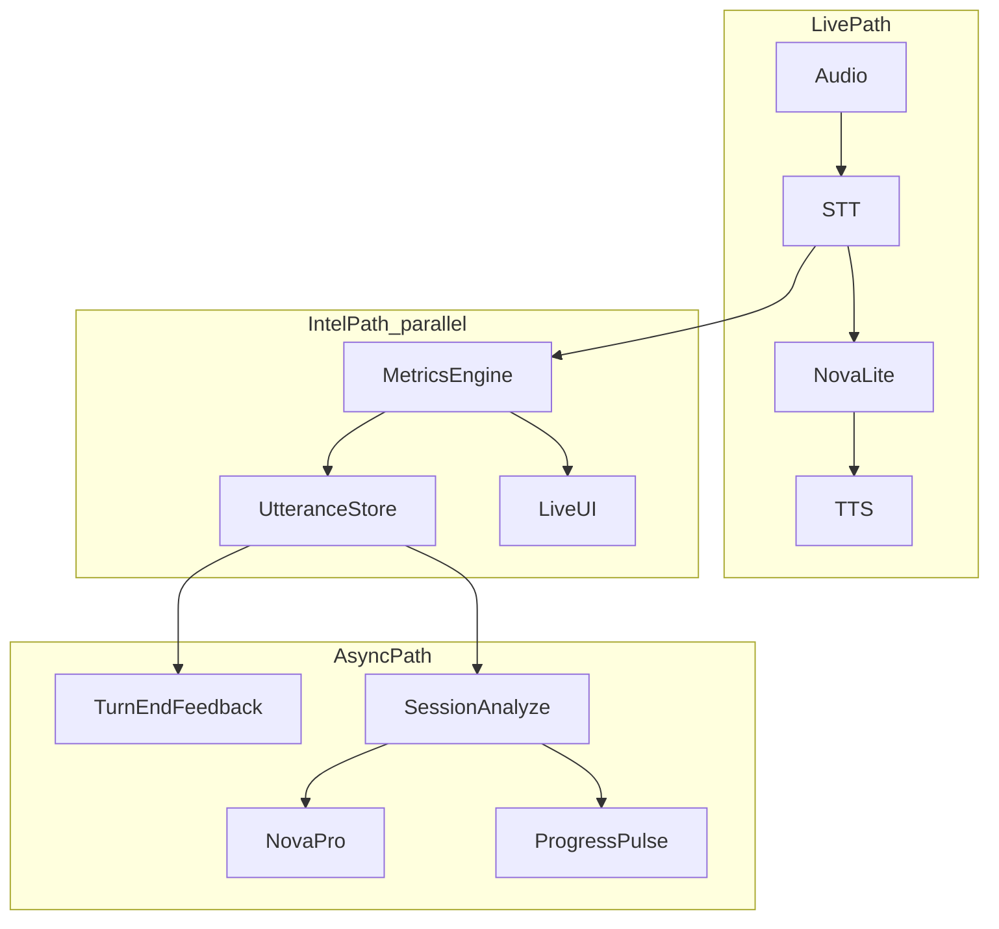

# SpashtAI North Star

> **Status:** Living document (June 2026)  
> **Audience:** Engineering, product, and anyone implementing Elevate, Replay, or analytics

SpashtAI is a **communication intelligence platform**, not a voice chatbot. Live voice is the **capture layer**; the **utterance timeline**—structured, measurable, replayable moments of speech—is the long-term asset. This document is the single source of truth for product architecture, the canonical data model, what we have today, what we are building toward, and what is explicitly parked.

For operational metrics APIs and field definitions, see [Metrics and Analytics Guide](./Metrics-and-Analytics-Guide.md). For deploy topology, see [EC2 Production](./EC2-PRODUCTION.md). Tactical work items belong in [Generic Backlog](./GENERIC-BACKLOG.md) and should reference North Star phases (P0–P5).

---

## Principles (non-negotiables)

1. **Live conversation must never block on analytics.** Deterministic metrics (WPM, fillers, hedges, vocabulary) are computed in parallel from the transcript stream. The coach must not call LLM tools to fetch numbers that the metrics engine already has.

2. **Right model for the right job.** Use **Nova Lite** (or **Nova Sonic**) for live coaching. Reserve **Nova Pro** for session-end analysis, coaching reports, and batch insight generation.

3. **One canonical Utterance object** flows through agent, server, UI, Progress Pulse, and (eventually) search. No duplicate ad-hoc message shapes for intelligence data.

4. **PREP and long-answer coaching need patient turn-taking.** Endpointing and monologue guards are first-class concerns, not afterthoughts.

5. **Build the spine before the sparkle.** Persist utterances and fix the live path (P0–P1) before Ask SpashtAI, proactive nudges, or per-utterance S3 files.

---

## Target architecture (layers)

### Layer 1 — Real-Time Conversation Engine

**Purpose:** Conduct coaching conversations with low latency.

**Recommended stack:**

```text
Audio Input → Whisper or Nova Sonic → Nova Lite → Polly or Kokoro
```

**Responsible for:**

- Exercise flow (PREP, signposting, rounds)
- PREP guidance and follow-up questions
- Clarifications and session control
- Warm, concise spoken responses

**Not responsible for:**

- WPM calculations
- Filler or hedging detection
- Vocabulary analysis
- Historical trend analysis
- Invoking tools solely to read metrics already on the dashboard

**Key code today:** [apps/agent/voice_backends.py](../apps/agent/voice_backends.py), [apps/agent/main.py](../apps/agent/main.py), [apps/agent/exercise_templates.py](../apps/agent/exercise_templates.py), [apps/agent/monologue_guard.py](../apps/agent/monologue_guard.py)

---

### Layer 2 — Communication Intelligence Engine

**Purpose:** Turn every user utterance into a structured intelligence object. This is the core moat.

**Responsible for:**

- Deterministic metrics per utterance (no LLM)
- Optional async feedback after turn completion (Lite or rules)
- Feeding live UI and persistence

**Not responsible for:**

- Blocking the live coach loop
- Replacing session-end deep analysis (Nova Pro)

**Key code today:** [apps/agent/speech_patterns.py](../apps/agent/speech_patterns.py), [apps/agent/live_pacing.py](../apps/agent/live_pacing.py), [apps/agent/turn_metrics.py](../apps/agent/turn_metrics.py), [apps/agent/metrics_collector.py](../apps/agent/metrics_collector.py)

---

### Layer 3 — Timeline Engine

**Purpose:** Persist sessions as ordered utterances, not only chat messages.

**Target model:**

```text
Session
├── Utterance
├── Utterance
├── Utterance
└── Utterance
```

**Session fields (existing):** `id`, `user_id`, `focusArea`, `startedAt`, `endedAt`, summary (future)

**Utterance fields (target):** see [Canonical Utterance schema](#canonical-utterance-schema) below.

**Key code today:** [apps/server/prisma/schema.prisma](../apps/server/prisma/schema.prisma) (`Session`, `SessionTranscript`), [apps/server/src/routes/conversations.ts](../apps/server/src/routes/conversations.ts)

---

### Layer 4 — Replay Experience

**Purpose:** Make past sessions sticky—timestamp, transcript, feedback, and audio at a moment.

**Target UX:**

| Time | Transcript | Feedback | Audio |
|------|------------|----------|-------|
| 00:42 | I think we should… | Hesitant opening | Play |
| 01:30 | We saved 20%… | Strong evidence | Play |

**v1 approach:** One session recording + `audio_offset_ms` / `audio_duration_ms` per utterance (no per-utterance WAV files required initially).

**Key code today:** Replay timeline pattern in [apps/web/src/pages/ReplayResults.tsx](../apps/web/src/pages/ReplayResults.tsx) (`CommunicationTimeline`); session audio via [apps/server/src/routes/audio.ts](../apps/server/src/routes/audio.ts) and `SessionRecording`. Elevate completed-session replay not yet built.

---

### Layer 5 — Elevate Memory

**Purpose:** Longitudinal user communication profile across sessions—not isolated session reports.

**Target:** Aggregated stats (avg WPM, filler rate, hedging rate, skill scores over time) updated after each session, surfaced to coaching context and Progress Pulse.

**Key code today:** [apps/server/src/routes/progress-pulse.ts](../apps/server/src/routes/progress-pulse.ts) (`buildCoachingContext`), agent `fetch_coaching_context` in [apps/agent/main.py](../apps/agent/main.py), [apps/server/src/routes/analytics.ts](../apps/server/src/routes/analytics.ts)

---

### Layer 6 — Progress Pulse

**Purpose:** Skill trends across Replay and Elevate sessions.

**Status:** **Strong** — shipping today.

**Key code today:** `ProgressPulse` model in Prisma, `GET /api/progress-pulse/summary`, [apps/web/src/components/analytics/ProgressPulseCard.tsx](../apps/web/src/components/analytics/ProgressPulseCard.tsx), [apps/server/src/analytics/skillScores.ts](../apps/server/src/analytics/skillScores.ts)

---

### Layer 7 — Ask Your Journey (parked)

**Purpose:** Conversational assistant over full communication history (“How have I improved in 3 months?”, “Show my best storytelling examples”).

**Requires:** Stable utterance store, cross-session index, RAG, cost controls.

**Do not start until P0–P1 complete and utterance schema is validated in production JSON.

---

### Layer 9 — Proactive Coach Mode (parked)

**Purpose:** Personalized real-time nudges from user history (“You tend to open with hedging”, “Three fillers in this answer”).

**Requires:** Reliable turn boundaries, utterance stream, user habit profile, non-blocking side channel to UI.

**Do not start until live Elevate is stable (P0) and utterances are persisted (P1).

---

## Target runtime split



**Live path** generates the next spoken coach response. **Intel path** runs in parallel and must not block TTS. **Async path** runs after turn or session end.

---

## Canonical Utterance schema

Every user (and optionally coach) utterance should converge on this shape:

```json
{
  "utterance_id": "u-001",
  "session_id": "s-123",
  "exercise_id": "structure",
  "speaker": "user",

  "start_ms": 42000,
  "end_ms": 48700,

  "transcript": "I think we should consider improving how we open meetings.",

  "metrics": {
    "word_count": 12,
    "filler_count": 0,
    "filler_rate": 0.0,
    "hedging_count": 1,
    "acknowledgment_count": 0,
    "vocab_diversity": 0.92,
    "wpm": 118,
    "speaking_seconds": 6.1,
    "qualitative_pace": "ideal",
    "coaching_tip": "Strong pacing on this turn — keep that rhythm."
  },

  "feedback": [
    {
      "type": "confidence",
      "message": "Hesitant opening"
    }
  ],

  "audio_offset_ms": 42000,
  "audio_duration_ms": 6700
}
```

| Field | Maps to today |
|-------|----------------|
| `metrics` | `TurnMetricsSnapshot` in [apps/agent/turn_metrics.py](../apps/agent/turn_metrics.py) |
| `exercise_id` | `Session.focusArea` |
| `start_ms` / `end_ms` | `LivePacingTracker` + session `startedAt` (to be wired) |
| `feedback` | Future; `coaching_tip` is a single-string precursor |
| Live UI | `turn_metrics` on `lk.conversation` → [apps/web/src/pages/Elevate.tsx](../apps/web/src/pages/Elevate.tsx) |
| Persistence (interim) | Target: `SessionTranscript.conversationData.utterances[]` alongside `messages[]` |

---

## Current state vs target

| Layer | Name | Status | Notes |
|-------|------|--------|-------|
| 1 | Real-Time Conversation Engine | **Partial** | `pipeline-bedrock` defaults Nova Pro; `TOOL_GROUNDING` mandates metric tools; dual endpointing (Silero + Transcribe) |
| 2 | Communication Intelligence Engine | **Partial** | Engine exists; metrics ephemeral in UI only |
| 3 | Timeline Engine | **Partial** | `Session` + `SessionTranscript.messages[]`; no `Utterance` model or `utterances[]` |
| 4 | Replay Experience | **Partial** | Replay annotated timeline; no Elevate replay; no audio seek |
| 5 | Elevate Memory | **Partial** | Coaching context API; no user-facing “communication journey” |
| 6 | Progress Pulse | **Strong** | Skill trends, deltas, history |
| 7 | Ask Your Journey | **Parked** | Not built |
| 9 | Proactive Coach Mode | **Parked** | Not built |

### Known Layer 1 issues (why Elevate feels broken on Transcribe + Pro + Polly)

- **Nova Pro** emits `<thinking>` blocks and triggers multi-hop tool rounds before Polly speaks.
- **Mandatory tools** (`get_live_pacing`, `get_speech_metrics`) block the coach despite parallel metrics collection.
- **Dual endpointing** (Silero VAD + Transcribe finals) produces fragment turns (`"I to"`, `"and"`) on long PREP answers.

Reference benchmark (external): [aws-samples/sample-voice-agent-on-aws](https://github.com/aws-samples/sample-voice-agent-on-aws) — `livekit-transcribe-polly` uses Transcribe + **Nova Lite** + Polly with a minimal agent (no Silero, no coaching tools).

---

## Voice stack guidance

| Stack | Best for | Caveats |
|-------|----------|---------|
| **Nova Sonic** | Live UX, PREP turn-taking, lowest latency | Stream recycle, interrupt tuning |
| **Whisper + Nova Lite + Kokoro/Polly** | Hybrid coaching, AWS credits, long-form STT | Requires Whisper host (EC2/local) |
| **Transcribe + Nova Lite + Polly** | Full AWS cloud | Dual endpointing; test Silero on/off |
| **Transcribe + Nova Pro + Polly** | Not recommended for live Elevate | Latency, thinking tags, tool bloat |

**Production recommendation (Elevate live):** Whisper or Sonic for STT + **Nova Lite** for coach + Polly/Kokoro for TTS. **Nova Pro** only in [apps/server/src/routes/analytics.ts](../apps/server/src/routes/analytics.ts) session analyze path.

Admin presets: [apps/web/src/pages/admin/VoiceBackend.tsx](../apps/web/src/pages/admin/VoiceBackend.tsx), [apps/server/src/routes/admin/voice-config.ts](../apps/server/src/routes/admin/voice-config.ts)

---

## Phased roadmap

| Phase | Focus | Layers | Success criteria |
|-------|--------|--------|------------------|
| **P0** | Fix live Elevate | 1 | Responsive PREP session; no thinking aloud; no metric tool blocking on critical path |
| **P1** | Persist utterances | 2, 3 | `conversationData.utterances[]`; turn metrics survive page reload |
| **P2** | Turn-end async feedback | 2 | Lite/rules `feedback[]` on utterance; does not delay coach audio |
| **P3** | Elevate session replay MVP | 4 | Timeline table on completed session; audio seek via session recording + offset |
| **P4** | Pulse enrichment | 5, 6 | Utterance aggregates inform Progress Pulse and session analyze |
| **P5** | Parked expansion | 7, 9 | Prisma `Utterance` table, Ask SpashtAI, proactive nudges |

### Do not start until P0 + P1

- Layer 7 (Ask Your Journey)
- Layer 9 (Proactive Coach Mode)
- Per-utterance S3 audio files
- New skill taxonomy (e.g. executive_presence, storytelling as first-class scores)
- Prisma `Utterance` migration (validate JSON schema in `conversationData` first)

---

## P0 testing matrix

Run the same PREP exercise (structure focus, ~6 minutes) under each config. Record:

| Config | Variables |
|--------|-----------|
| A | Transcribe + Nova Lite + Polly |
| B | Transcribe + Nova Lite + Polly, Silero disabled (if supported) |
| C | Whisper + Nova Lite + Polly/Kokoro |
| D | Nova Sonic |
| E | Transcribe + Nova Pro + Polly (baseline — expect worse) |

**Metrics to capture:**

| Metric | How |
|--------|-----|
| Time from user stop speaking → first coach audio | Stopwatch / agent logs |
| Utterances per 60s PREP answer | Count persisted or logged user turns |
| Coach `get_live_pacing` / `get_speech_metrics` calls per coach turn | Agent logs |
| STT fragments (under 3 words) | Transcript review |
| User-reported “stuck” or interrupt mid-answer | Qualitative |

---

## What is real-time vs async

### Real-time (no LLM)

| Signal | Engine |
|--------|--------|
| Fillers, hedges, acknowledgments | `speech_patterns.py` |
| WPM, speaking seconds | `live_pacing.py`, `turn_metrics.py` |
| Vocabulary diversity | `turn_metrics.py` |
| Live session snapshot | `metrics_collector.py` → `lk.metrics` |
| Turn cards in UI | `turn_metrics` → Elevate |

### Turn-end (async, Lite or rules)

- PREP structure score on complete answer
- Confidence / opening strength labels
- Populates `feedback[]` on utterance

### Session-end (Nova Pro)

- Executive summary, growth areas, improvement plan
- Skill scores → Progress Pulse via [apps/server/src/analytics/progressPulse.ts](../apps/server/src/analytics/progressPulse.ts)
- Full pipeline: `POST /sessions/:sessionId/analyze`

---

## Key code touchpoints (P0–P1 implementers)

**Agent**

- [apps/agent/voice_backends.py](../apps/agent/voice_backends.py) — default LLM, STT/TTS providers, Silero VAD
- [apps/agent/main.py](../apps/agent/main.py) — `TOOL_GROUNDING`, `CoachingAgent`, `conversation_item_added`, metric tool definitions
- [apps/agent/metrics_collector.py](../apps/agent/metrics_collector.py) — turn commit, `publish_pending_user_utterance_metrics`
- [apps/agent/text_sanitize.py](../apps/agent/text_sanitize.py) — strip `<thinking>` before TTS

**Server**

- [apps/server/src/routes/conversations.ts](../apps/server/src/routes/conversations.ts) — message persist; extend for `utterances[]`
- [apps/server/src/routes/analytics.ts](../apps/server/src/routes/analytics.ts) — session-end analyze (keep Pro here)

**Web**

- [apps/web/src/pages/Elevate.tsx](../apps/web/src/pages/Elevate.tsx) — turn metrics UI, chat bubbles
- [apps/web/src/hooks/useConversationPersistence.ts](../apps/web/src/hooks/useConversationPersistence.ts) — load/save messages

**Admin**

- [apps/web/src/pages/admin/VoiceBackend.tsx](../apps/web/src/pages/admin/VoiceBackend.tsx) — stack presets (add Nova Lite cloud preset)

---

## Relationship to other documentation

| Document | Role relative to North Star |
|----------|----------------------------|
| [Metrics and Analytics Guide](./Metrics-and-Analytics-Guide.md) | Operational reference for metrics fields and APIs |
| [Advanced Analytics Architecture](./Advanced-Analytics-Architecture.md) | Audio/NLP delivery pipeline (Phase 2+ skills) |
| [Generic Backlog](./GENERIC-BACKLOG.md) | Tactical items; reference P0–P5 phases |
| [EC2 Production](./EC2-PRODUCTION.md) | Deploy topology; align voice stack with North Star |
| [LOCAL-DEVELOPMENT-SETUP.md](./LOCAL-DEVELOPMENT-SETUP.md) | Local dev workflow |

---

## Revision history

| Date | Change |
|------|--------|
| 2026-06 | Initial North Star — layered architecture, utterance model, phased roadmap |
